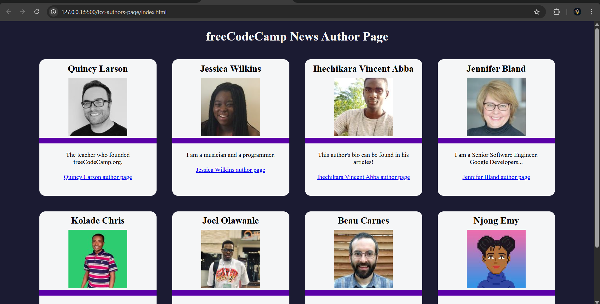

# 🧠 JavaScript Projects Portfolio

This repository showcases a curated set of JavaScript projects built during my journey through freeCodeCamp and self-practice. These projects demonstrate my hands-on experience with:

- DOM manipulation
- Local storage
- Object-oriented and functional programming
- Fetch API and asynchronous JavaScript
- Algorithmic thinking and UI interactivity

Each project is placed in a separate folder, includes readable code, and is accompanied by a visual screenshot.

---

## 📂 Projects Included

---

### ✅ To-Do App

A task management application that allows users to add, mark, and delete tasks. Uses local storage to preserve tasks across sessions.

- 📸 
- 📁 [Source Code](./to-do-app/)

---

### ✅ Shopping Cart

A dynamic shopping cart simulation that handles product quantities, cart totals, and item removal. Built using OOP principles.

- 📸 
- 📁 [Source Code](./shopping-cart/)

---

### ✅ Platform Game

A side-scrolling platformer built from scratch with vanilla JavaScript. Features character movement, collision detection, and basic physics logic.

- 📸 
- 📁 [Source Code](./platform-game/)

---

### ✅ Statistics Calculator

Performs calculations such as mean, median, mode, range, and standard deviation. Demonstrates use of advanced array methods and clean UI.

- 📸 
- 📁 [Source Code](./statistics-calculator/)

---

### ✅ FCC Authors Page

Fetches and displays author profiles from the freeCodeCamp API. Built using Fetch, Promises, and dynamic DOM rendering.

- 📸 
- 📁 [Source Code](./fcc-authors-page/)

---

### ✅ FCC Forum Leaderboard

Fetches real-time user data from the FCC forums and displays a leaderboard. Demonstrates async JavaScript and JSON handling.

- 📸 
- 📁 [Source Code](./fcc-forum-leaderboard/)
